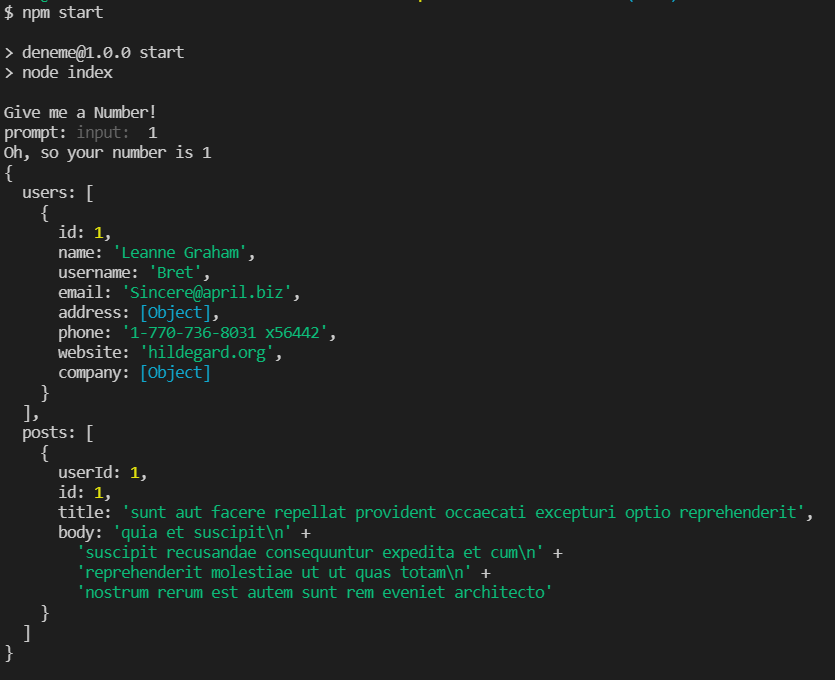

# React practice

## Main Purpose
- practise how to retrieve data from another source in web.
- to show the data in the console.
- practicing how to use hooks and props.
- using "axios" for async functionality.
- exporting and importing data from another file.

## Output

